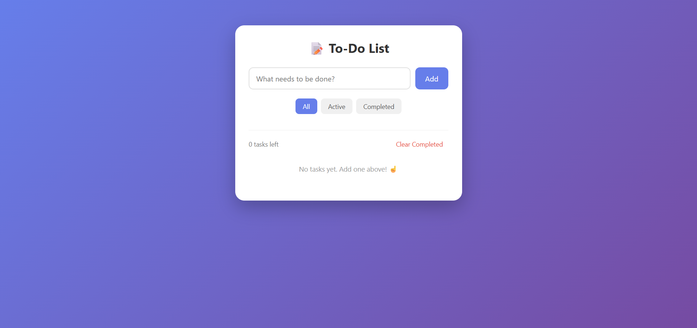

# 📝 To-Do List App

A simple, elegant, and fully functional to-do list built with **vanilla HTML, CSS, and JavaScript**. No frameworks, no build tools, no dependencies — just clean, readable code you can learn from.



---

## 🚀 Live Demo

👉 **[https://to-do-website-snowy.vercel.app/](https://to-do-website-snowy.vercel.app/)**

Try it directly in your browser — no installation required.

---

## ✨ Features

- ➕ **Add tasks** — type and press Enter, or click Add
- ✅ **Mark tasks complete** — click the checkbox
- ❌ **Delete tasks** — click the ✕ button
- 🔍 **Filter tasks** — view All, Active, or Completed
- 🧹 **Clear completed** — remove all finished tasks at once
- 💾 **Persistent storage** — tasks survive browser refresh via `localStorage`
- 🔢 **Live counter** — shows how many tasks are left
- 🛡️ **XSS-safe** — user input is HTML-escaped before rendering
- 🎬 **Smooth animations** — tasks slide in on add
- 📱 **Responsive** — works beautifully on desktop and mobile

---

## 🛠️ Tech Stack

| Layer | Tech |
|-------|------|
| Structure | HTML5 |
| Styling | CSS3 (with animations) |
| Logic | Vanilla JavaScript (ES6+) |
| Storage | Browser `localStorage` API |
| Hosting | Vercel |

**Zero dependencies.** No React, no Vue, no Tailwind. Just the web platform.

---

## 📁 Project Structure

```
todo-app/
├── index.html      # UI structure
├── style.css       # Styling and animations
├── script.js       # App logic
└── README.md
```

---

## 🚀 Getting Started

### Run locally

Just open `index.html` in your browser — that's it. 🎉

Or use a local server for auto-reload:

```bash
# Option 1: Using npx serve
npx serve .

# Option 2: Using VS Code Live Server extension
# Right-click index.html → Open with Live Server
```

Then visit `http://localhost:3000` (or whatever port the tool prints).

### No installation needed

There's nothing to install. No `npm install`. No build step. Just three files.

---

## 📖 How to Use

1. **Add a task** — Type in the input box and press `Enter` or click **Add**
2. **Complete a task** — Click the checkbox next to it
3. **Delete a task** — Click the ✕ button on the right
4. **Filter tasks** — Use **All / Active / Completed** buttons
5. **Clear completed** — Click **Clear Completed** at the bottom

All changes are saved automatically to your browser's `localStorage`.

---

## 🎨 How It Works

### State management
The app stores all tasks in a single array:

```javascript
let tasks = [
  { id: 1732893300000, text: "Buy groceries", completed: false },
  { id: 1732893310000, text: "Finish project", completed: true }
];
```

The entire UI is re-rendered from this array using a `render()` function — a pattern used in many frameworks like React.

### Persistence
Every change calls `save()`:

```javascript
localStorage.setItem('tasks', JSON.stringify(tasks));
```

On page load, tasks are read back:

```javascript
let tasks = JSON.parse(localStorage.getItem('tasks')) || [];
```

### Filtering
The `currentFilter` variable (`'all' | 'active' | 'completed'`) controls which tasks are shown, without changing the underlying data.

---

## 🚢 Deploying

This is a **static site** — deploy it anywhere in seconds.

### Option 1: Vercel (recommended — used for this project)
1. Push this repo to GitHub
2. Go to [vercel.com](https://vercel.com) → **Add New Project** → **Import from GitHub**
3. Pick your repo
4. Framework preset: **Other** (no build command needed)
5. Click **Deploy** ✅

### Option 2: Netlify
1. Push this repo to GitHub
2. Go to [app.netlify.com](https://app.netlify.com) → **Add new site** → **Import from GitHub**
3. Pick your repo
4. Build command: *(leave empty)*
5. Publish directory: `.`
6. Click **Deploy**

### Option 3: Drag & Drop
1. Go to [app.netlify.com/drop](https://app.netlify.com/drop)
2. Drag your project folder onto the page
3. Done — instant live URL

### Option 4: GitHub Pages
1. Push to GitHub
2. Repo → **Settings** → **Pages**
3. Source: `main` branch, root folder
4. Save — live at `https://your-username.github.io/repo-name/`

---

## 🎁 Possible Future Features

Want to extend it? Here are some ideas:

- ✏️ **Edit task text** — double-click to rename
- 🌙 **Dark mode toggle** — save preference to localStorage
- 📅 **Due dates** — add `<input type="date">` per task
- 🏷️ **Categories/Tags** — group tasks by type
- 🔀 **Drag to reorder** — using the Drag and Drop API
- ☁️ **Cloud sync** — Firebase or Supabase
- 📤 **Export/Import** — as JSON or CSV
- 🔔 **Notifications** — for upcoming deadlines

---

## 📄 License

This project is licensed under the **MIT License** — free to use, modify, and share.

---

## 🙌 Acknowledgements

- Inspired by countless to-do apps, made simple.
- Built with love for the web platform. ❤️

---

## ⭐ Show Your Support

If this helped you learn something, give the repo a ⭐ on GitHub!
